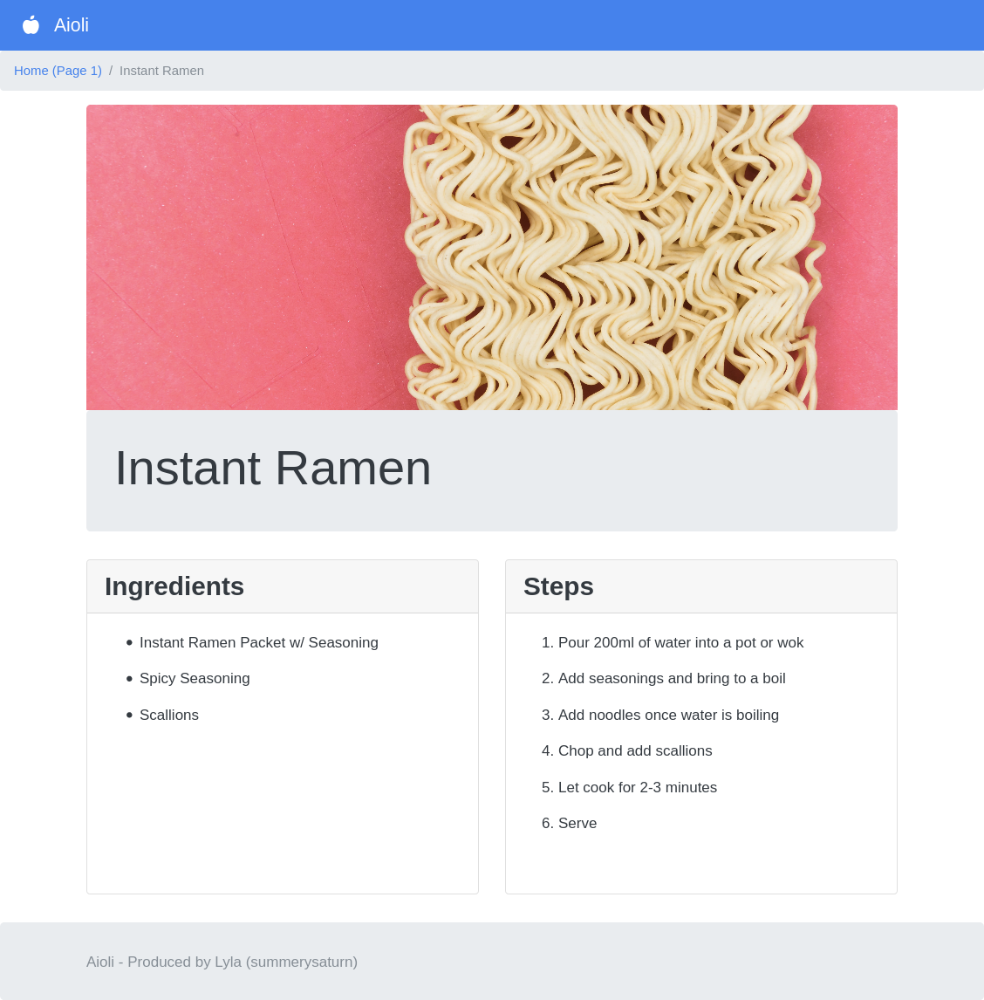

# 'Aioli' | recipe-book-core

A tool for creating a static site out of markdown-format recipes.

[Example of a page built using this app](example.html)

This is a simple(ish) python implementation of a static-site-generator designed solely to make a recipe-book out of Asciidoctor(ish) files.

The core concept is using a simple file with a title, set of ingredients, and steps, and turning that into a webpage that presents the same information in an easy to digest format. The built static site features pagination(ish), subpages, working links, etc.
